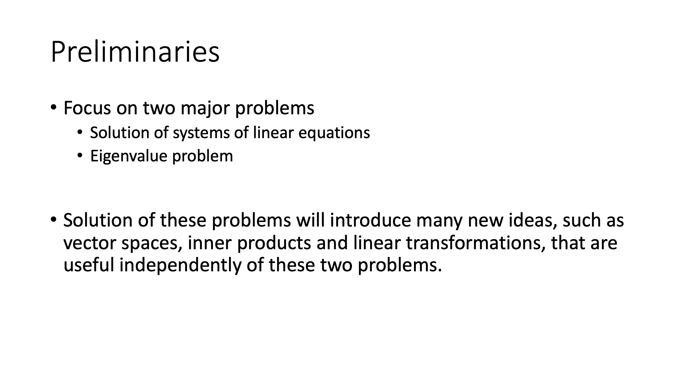
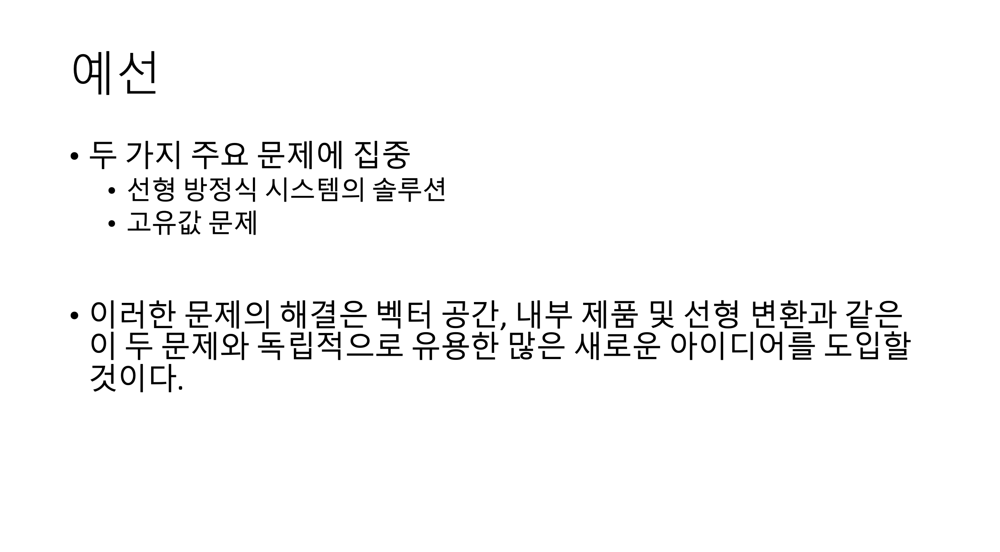

# Papago API를 활용한 PPT 번역 프로그램

## 파파고 API 등록
[네이버 개발자 센터](https://developers.naver.com/)
Application -> 내 애플리케이션 등록 -> Papago 번역

## 실행 코드
python3 ppt_translate.py [파일 경로/파일명] [파파고 API 아이디] [파파고 API 비밀번호]

## 실행 예시
**BEFORE**

|||
|-----------------------------|-----------------------------|

**AFTER**

|||
|----------------------------|----------------------------|

## ISSUES
1. 빈칸이 있는 ppt에서 발생하는 에러(완료)
* 빈칸 제거 split 후 다시 join